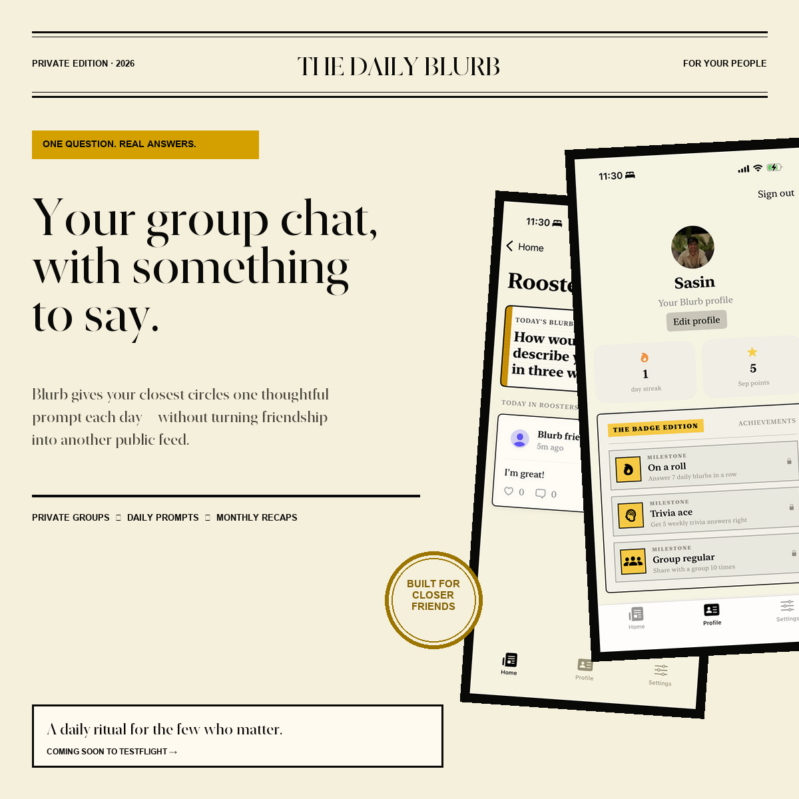

# Daily Burb

Daily Burb is a private social app that helps close friends stay connected through one thoughtful question each day. Instead of placing everyone into a public feed, the app organizes conversations around small, intentional groups.

Each group has its own daily feed, so people can answer differently depending on who they are talking to. Answers can also be reused across selected groups when the same response feels appropriate.

[Visit the project website](https://sasinkg.github.io/blurb/)



## Why I built it

Most social apps optimize for broadcasting and endless consumption. Daily Burb explores a different model: a small daily ritual that creates conversation between people who already care about one another.

The product is built around three principles:

- Private by default
- Group context matters
- Participation should feel intentional, not addictive

## Features

- One daily question shared across the app
- Separate private feeds for each friend group
- Different answers for different groups
- Reuse an answer in one or more other groups
- Create groups and join them with secure invite codes
- Real-time group posts and participation counts
- Text and photo responses
- Profile names and profile photos
- Likes, comments, streaks, points, and achievement badges
- Weekly trivia
- One private reflection question each week for monthly recaps
- Two recurring photo prompts each month
- Light, dark, and system appearance settings
- Sign in with Apple, sign out, and account deletion

## Architecture

Daily Burb is a native iOS application written in SwiftUI. It uses a lightweight, MVVM-inspired architecture with Firebase as the backend.

### App and presentation layer

`blurbApp` configures Firebase, owns the shared authentication and app-data objects, and chooses between onboarding and the signed-in experience.

`ContentView` contains the primary SwiftUI navigation and presentation flow. The interface uses a group-first home screen instead of a universal social feed. Native `NavigationStack`, sheets, tab navigation, photo pickers, and system appearance APIs keep the experience familiar on iPhone and iPad.

The visual system uses a newspaper-inspired editorial style with serif typography, strong rules, rectangular cards, and a contextual yellow accent that adapts between light and dark mode.

### State and data layer

`BlurbStore` is the app's central `ObservableObject`. It owns groups, posts, profile data, selected-group state, and Firebase listeners. Keeping Firebase access in one store gives views a consistent source of truth and prevents backend details from spreading throughout the UI.

Firestore snapshot listeners keep group membership, feeds, profiles, and answer counts current without requiring manual refreshes. New groups are also inserted into local state immediately after a successful write, giving the interface responsive feedback while the listener catches up.

`QuestionBank` generates deterministic prompts locally. This avoids a backend request just to display the day's question and ensures everyone sees the same prompt for a given date. It also schedules weekly trivia, private reflection prompts, and photo prompts.

### Authentication

`AuthManager` wraps Sign in with Apple and Firebase Authentication. Apple credentials authenticate the Firebase user, while the user's available name is persisted to their Firestore profile. Email/password accounts can also sign in or sign up through **Continue with email**, with password reset available. New accounts choose a display name and optional profile photo before entering the group experience. Completion is saved in the user profile so unfinished setup resumes on the next launch. Legacy accounts with a real display name are treated as already set up. Firebase's authentication-state listener determines whether the app displays onboarding or the main experience.

### Firebase services

- **Firebase Authentication:** Sign in with Apple and user sessions
- **Cloud Firestore:** Profiles, groups, invitations, posts, reactions, and real-time updates
- **Cloud Storage:** Profile pictures and photo responses
- **Firebase Security Rules:** Membership-based access control and upload validation

## Data model

The main Firestore collections are:

```text
users/{userID}
groups/{groupID}
groupInvites/{inviteCode}
posts/{postID}
```

A post contains a `groupID`, so the same person can submit a different response in each group. Posts also contain a `viewerIDs` snapshot used by feed queries and security rules.

Invitations are deliberately separated from group documents. A signed-in person can fetch a single invite only when they know its exact code, but invite documents cannot be listed or queried. Normal group documents remain readable only by their members. Creating a group writes the group and its invite together in a Firestore batch.

Images use predictable, user-scoped Storage paths:

```text
profile-images/{userID}.jpg
post-images/{groupID}/{userID}/{postID}.jpg
```

Storage rules limit uploads to authenticated users, image content types, files under 5 MB, and the appropriate user or group membership.

## Important architecture choices

### Groups are the core social boundary

The home screen presents the user's groups and today's participation rather than combining every friend into one feed. Entering a group feels like entering a private room, and every response retains its conversational context.

### Answers belong to groups

Responses are stored as group-specific posts instead of one global answer copied everywhere. This avoids context collapse between family, friends, classmates, or coworkers. A reuse flow preserves convenience without removing control.

### Invite lookup is separate from group access

Allowing invite-code queries directly against `groups` would require broader read permissions than the product's privacy model should allow. The separate `groupInvites` collection supports direct code lookup while keeping group metadata private.

### Prompts are deterministic and local

The prompt calendar lives in the app rather than requiring a scheduled backend job for the MVP. This lowers complexity and cost while still providing daily, weekly, monthly, trivia, and photo-based experiences.

### Native-first interface

The app favors SwiftUI and Apple platform conventions over a custom cross-platform navigation system. This provides native gestures, accessibility behavior, appearance support, and familiar controls with a relatively small codebase.

## Running the project

### Requirements

- macOS with Xcode
- An Apple Developer account for Sign in with Apple and device distribution
- A Firebase project with Authentication, Firestore, and Storage enabled
- Firebase CLI for deploying backend rules

### Setup

1. Clone the repository.
2. Open `blurb.xcodeproj` in Xcode.
3. Add your Firebase iOS configuration file as `blurb/GoogleService-Info.plist`.
4. Confirm the bundle identifier and development team under **Signing & Capabilities**.
5. Enable the **Sign in with Apple** capability.
6. In Firebase Authentication, enable Apple as a sign-in provider.
7. Build and run on an iPhone, iPad, or simulator.

### App Review account

1. In the intended Firebase project, open **Authentication → Sign-in method**, enable **Email/Password**, and save. Email-link sign-in is not needed.
2. In **Authentication → Users → Add user**, create a dedicated review account using an email inbox you control and a unique password. Keep its credentials out of source code and documentation.
3. Build the app with this change. On the welcome screen, choose **Continue with email** and sign in with that account. Its Firestore profile is created on first login. Complete the name/photo setup when prompted.
4. Sign in to the configured review account and select **Settings → Review examples → Add example group** (also available during group onboarding). This creates a private **Example group** with three fictional, labeled answers and one sample reply each. The action is available only to the UID in `ReviewConfiguration.swift`, checks that UID again in the store, reuses an owned example group, and fills missing sample data without overwriting existing posts/replies. Sample posts remain visible across daily prompt changes and do not award points or streaks. Names are fictional labels; records belong to the review account, and no fake Auth users or real users are added. The group starts with only the review account as a member. Add your own photo response to demonstrate uploads; photo fixtures and saved newsletter editions are not seeded. Normal Firestore membership rules still apply.
5. Verify sign-out/sign-in and password reset. Check wrong-password and offline errors, as well as the existing Apple sign-in flow. The UI smoke tests check form validation, password confirmation, and cancellation; it does not authenticate against Firebase.
6. Upload a new build with an unused build number. In App Store Connect → TestFlight → Test Information → Beta App Review Information, select **Sign-in required**, enter the account's email as **User Name**, and enter its password. Include the testing instructions below, save, and reply to the review message. Earlier uploaded builds do not gain the new login screen.

Suggested review notes (adapt to the populated account):

> On the welcome screen, select Continue with email and use the supplied credentials. This is a dedicated review account. Open Example group on Home to see labeled fictional conversations and try likes, comments, and posting your own answer. Answer the current daily prompt in Example group to unlock its sample conversations. Ordinary groups have the same answer-first requirement. If the example group is missing, choose Add example group during onboarding or under Settings → Review examples. Open the group's Monthly newsletter to preview its current content; Settings also includes Open demo newsletter. Profile and Settings provide profile editing, notification settings, and account management. Saved monthly editions are generated on the third of the next month, so an account without archived editions may show an empty archive.

Account deletion remains available and is destructive. Confirm the review account is usable before each submission and restore its sample data if it has been deleted. This is a normal authenticated account with the same rules as other users, not an authentication bypass.

### Version and build numbers

The project is prepared as **version 1.1, build 3**. In Xcode, select the blue **blurb** project, then **Targets → blurb → General → Identity**. **Version** is the release label (`MARKETING_VERSION`); **Build** identifies an uploaded build (`CURRENT_PROJECT_VERSION`). For another upload of version 1.1, increment Build to an unused number, for example 4. These settings are stored in `blurb.xcodeproj/project.pbxproj`. Check Organizer's final version/build when uploading because its automatic version-management option can adjust the build number. Preparing these values does not archive, upload, or release the app.

### Deploy Firebase rules and indexes

Select your Firebase project and deploy the checked-in configuration:

```bash
firebase use YOUR_PROJECT_ID
firebase deploy --only firestore:rules,firestore:indexes,storage --project YOUR_PROJECT_ID
```

## Project structure

```text
blurb/
├── blurbApp.swift        App entry point and appearance configuration
├── AuthManager.swift     Sign in with Apple and Firebase authentication
├── BlurbStore.swift      Models, shared state, and Firebase data operations
├── ContentView.swift     Main navigation and signed-in SwiftUI experience
├── QuestionBank.swift    Daily and recurring prompt scheduling
├── WelcomeView.swift     Authentication and onboarding interface
└── Assets.xcassets       App icon, colors, and image assets

firebase/
├── firestore.rules       Firestore authorization rules
├── firestore.indexes.json
└── storage.rules         Image access and validation rules

docs/                     GitHub Pages website and promotional assets
```

## Current status

Daily Burb is an MVP under active development. The core group, prompt, profile, photo, authentication, and Firebase flows are implemented. Future work includes notification scheduling, richer monthly reports, moderation tools, accessibility testing, analytics, automated tests, and additional production hardening.

## Built by

Created by [Sasin Gudipati](https://github.com/sasinkg).


### Group sharing, ranks, and mentions

Settings → Groups → the share menu offers **Copy group code** and **Copy invite link**.
Achievement progress is scoped to the selected group. Profile shows the highest earned tier and
progress toward the next tier; post headers show earned tiers below the author's name.

- Streaks: On a Roll (3 days), On Fire (7), Unstoppable (14), Daily Legend (30), Supernova (100).
- Trivia: Star (3 correct), Ace (5), Master (10), Genius (20), Legend (50).
- Sharing: Group Regular (10 answers), Favorite (25), Pillar (50), Legend (100), Icon (250).

Streak achievements use the longest qualifying run with a 5 AM Pacific day boundary. Trivia
counts distinct correct, unedited trivia prompts; sample posts never earn achievements. Progress
is calculated from retained group posts, so deleting qualifying history can reduce it. The pinned
answer appears over the top of the feed only when the user's answer card is outside the scroll
viewport. Missing placement and points fields no longer default to one.

Type `@` at the end of an answer or reply to see name suggestions from group contributors;
selecting a name inserts its first name. First-name mentions can also be typed directly and are
highlighted in conversations. Names and mentions open a group member profile with their shared photo, earned badges, and group progress. Mentions resolve against current members represented in loaded group answers and replies; duplicate first names show a chooser, and unmatched names show an unavailable state. Photos can be enlarged from the profile. Mention pushes are implemented for new answers, newly added mentions in edited answers, and replies. They require the deployed Firebase functions and the recipient enabling Replies and @mentions in Settings. Only unambiguous first names of current members notify; self-mentions and sample posts are excluded. A mentioned post author receives one notification rather than both a reply and mention push. Push previews do not expose answer text. Delivery receipts suppress repeated events with at-most-once delivery (a send failure after claiming an event is not retried automatically). Replies can be liked or unliked in the feed and reply thread; deployed Firestore rules restrict each member to changing their own like.
